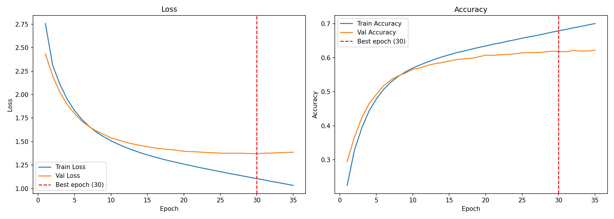
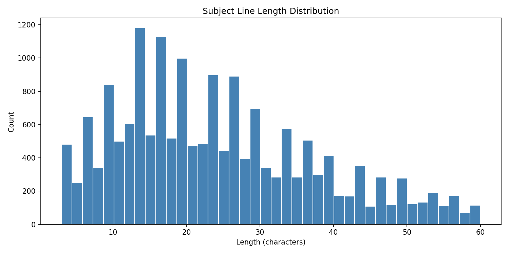
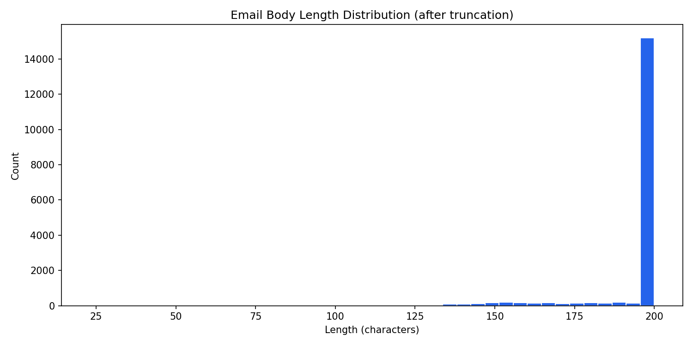

# email-subject-generator

This project generates professional email subject line suggestions from an email body using T5-small, a 60-million-parameter transformer model fine-tuned on the Annotated Enron Subject Line Corpus (AESLC). The motivation was a simple observation: the encoder-decoder LSTM that preceded it produced plausible-sounding but content-agnostic suggestions — it had learned Enron-flavoured patterns, not how to read an email. T5's attention mechanism solves this at the architecture level: the decoder can look back at every token in the input at every generation step, grounding each suggestion in what the user actually wrote. The model returns five subject lines per request, spanning a temperature range from conservative beam search to creative nucleus sampling, so the user can pick the tone that fits.

**Live demo → [email-subject-gen-xoc.azurewebsites.net](https://email-subject-gen-xoc.azurewebsites.net)**
&nbsp;&nbsp;·&nbsp;&nbsp;
**API docs → [/docs](https://email-subject-gen-xoc.azurewebsites.net/docs)**
&nbsp;&nbsp;·&nbsp;&nbsp;
**Notebook → notebook.ipynb**


---

## 0. Prerequisites

- Python 3.11+
- No API keys required — model is committed to the repo and loaded at startup
- Git LFS required to clone the model weights (`git lfs install` before cloning)

---

## 1. Quick start

```bash
git clone https://github.com/xavier-oc-programming/email-subject-generator
cd email-subject-generator

python -m venv venv && source venv/bin/activate
pip install -r requirements.txt

# Model is committed — run the app immediately:
uvicorn main:app --reload
# → http://localhost:8000

# Or retrain from scratch (30–60 min on Apple Silicon):
python train_t5.py
```

---

## 2. Project structure

```
email-subject-generator/
├── config.py                  # All constants — single source of truth
├── train_t5.py                # Fine-tuning script — run once locally
├── generator.py               # Inference: generate_subject, generate_multiple
├── main.py                    # FastAPI app
├── notebook.ipynb             # Architecture walkthrough + LSTM baseline
├── requirements.txt
├── Dockerfile
├── startup.txt
├── .gitattributes             # Git LFS tracking for model.safetensors
├── .gitignore
├── .github/
│   └── workflows/
│       └── ci.yml             # CI test + deploy pipeline
├── templates/
│   └── index.html             # Demo frontend
├── models/
│   └── t5/                    # Fine-tuned model — committed via Git LFS
│       ├── model.safetensors  # 231 MB — tracked by LFS
│       ├── tokenizer.json
│       ├── tokenizer_config.json
│       ├── config.json
│       └── generation_config.json
├── plots/                     # Training and data charts
└── tests/
    └── test_api.py
```

---

## 3. Core concepts

**T5 (Text-to-Text Transfer Transformer).** T5 frames every NLP task as a text-in → text-out problem. For subject generation the input is `"generate subject: <email body>"` and the target is the subject line. The model was pre-trained by Google on 750 GB of text, giving it strong general language understanding before fine-tuning on domain-specific data. T5-small has 60M parameters — large enough to produce coherent output, small enough to train in under an hour on a laptop.

**Encoder-decoder attention.** Unlike an LSTM, which compresses the entire input into a single fixed-size vector before decoding, T5's decoder attends to every encoder token at every generation step. This means a subject line about "Q3 budget" can directly reference the words "Q3" and "budget" from the body rather than relying on whatever survived a compression bottleneck.

**Fine-tuning vs. training from scratch.** Pre-training a model like T5 requires thousands of GPU-hours. Fine-tuning adapts pre-trained weights to a specific task in a fraction of the time — here, 3 epochs on 13,774 email/subject pairs in under 30 minutes. The model already understands English grammar and professional language; fine-tuning teaches it the email subject-line domain.

**Temperature and decoding strategy.** At low temperatures (≤ 0.6) the model uses beam search — it explores multiple candidate sequences and returns the highest-probability one, producing conservative, predictable subject lines. At higher temperatures it switches to nucleus (top-p) sampling with p=0.92, drawing from the most probable tokens until their cumulative probability hits 0.92, producing more varied output. The five suggestions span the range so the user can choose the tone they need.

**LSTM baseline.** The original encoder-decoder LSTM (kept in the notebook) uses a character-level vocabulary and compresses 200 input characters into a single `[h, c]` context vector — a fundamental bottleneck that attention resolves. Running both on the same inputs makes the quality gap concrete: the LSTM produces plausible but generic phrases regardless of input; T5 produces body-grounded suggestions.

---

## 4. Dataset

**AESLC — Annotated Enron Subject Line Corpus** — ~17,000 real email body/subject pairs from the Enron dataset, professionally annotated for clean subject line alignment.

```python
from datasets import load_dataset
ds = load_dataset('aeslc')
```

- **Size:** 14,436 train / 1,960 validation / 1,906 test (before filtering)
- **After filtering:** 13,774 train / 1,838 validation / 1,825 test
- **Filter criteria:** body ≥ 20 characters, subject 3–60 characters
- **Body truncation:** first 200 characters fed to the model — subject lines are determined by the opening of an email, not its full length

---

## 5. Model

### T5-small fine-tuned on AESLC

T5-small (60M parameters) was chosen as the best balance between quality and deployability. Larger T5 variants produce better output but are impractical for an Azure F1 free-tier deployment — T5-small's model file is 231 MB, which fits cleanly in the zip deploy and loads in a few seconds on a cold start. Fine-tuning ran for 3 epochs with batch size 16, warmup over 200 steps, and weight decay of 0.01. `Seq2SeqTrainer` saves the best checkpoint by validation loss automatically.

### Encoder-decoder LSTM (baseline, notebook only)

The LSTM baseline uses a character-level vocabulary, a 64-dimensional embedding, and a single LSTM layer with 256 units. It trains with teacher forcing — at each decoding step the true previous character is fed as input rather than the model's own prediction, which stabilises training on short outputs. It is retained in the notebook as a documented comparison, not served by the API.

---

## 6. Results

| | Epoch 1 | Epoch 2 | Epoch 3 |
|---|---|---|---|
| Eval loss | 3.396 | 3.328 | **3.309** |

The key qualitative result is content grounding. Given the input *"Following up on our discussion about the Q3 budget proposal. Please review the attached document and confirm next steps before Friday"*, the LSTM returns Enron-era generic phrases regardless of temperature. T5 returns variations on budget review, Q3 follow-up, and action-required framing — drawn from the actual email body.

---

## 7. Inference — temperature and decoding

`generate_multiple()` generates five suggestions by running `generate_subject()` across a linear temperature range. At the conservative end, beam search finds the highest-probability sequence. At the creative end, nucleus sampling introduces controlled randomness.

```python
from generator import generate_multiple

suggestions = generate_multiple(
    "Following up on the Q3 budget proposal — please confirm next steps.",
    n=5,
    temperature_range=(0.5, 0.9),
)
# [
#   {"subject": "Q3 Budget Proposal Follow-Up", "temperature": 0.5, "style": "conservative"},
#   {"subject": "Action Required: Q3 Budget Review", "temperature": 0.6, "style": "balanced"},
#   {"subject": "Next Steps on Q3 Budget",         "temperature": 0.7, "style": "balanced"},
#   ...
# ]
```

| Temperature | Decoding | Style label |
|-------------|----------|-------------|
| ≤ 0.6 | Beam search (num_beams=4) | conservative |
| 0.6–0.8 | Nucleus sampling (top_p=0.92) | balanced |
| > 0.8 | Nucleus sampling (top_p=0.92) | creative |

---

## 8. Visualisations

Training curves and data distributions are generated by the notebook and committed to `plots/`.



*Loss and validation loss over epochs — shows convergence without overfitting.*



*Distribution of subject line lengths in the AESLC corpus — informs the 3–60 character filter.*



*Distribution of email body lengths — informs the 200-character truncation threshold.*

---

## 9. API reference

### `POST /generate`

```json
// Request
{
  "body_text": "Following up on our Q3 budget discussion...",
  "n": 5,
  "temperature": null
}

// Response
{
  "suggestions": [
    {"subject": "Q3 Budget Follow-Up", "temperature": 0.5, "style": "conservative"},
    {"subject": "Action Required: Budget Review", "temperature": 0.7, "style": "balanced"}
  ],
  "body_preview": "Following up on our Q3...",
  "model_info": "T5-small | Fine-tuned on AESLC | epochs=3 | train_size=13774",
  "n_generated": 5
}
```

### `GET /health`

Returns API health status and whether the model is loaded.

### `GET /api/model-info`

Returns the full model config from `models/t5_config.json`.

### `GET /api/examples`

Returns 5 pre-written example email bodies for the demo UI.

---

## 10. Deployment — Azure App Service

```bash
# 1. Create resource group and plan
az group create --name email-subject-gen-rg --location westeurope
az appservice plan create --name email-subject-gen-plan \
  --resource-group email-subject-gen-rg --sku F1 --is-linux

# 2. Create web app
az webapp create --name email-subject-gen-xoc \
  --resource-group email-subject-gen-rg \
  --plan email-subject-gen-plan --runtime "PYTHON:3.11"

# 3. Configure startup and build
az webapp config set --name email-subject-gen-xoc \
  --resource-group email-subject-gen-rg \
  --startup-file "gunicorn main:app --workers 1 --worker-class uvicorn.workers.UvicornWorker --bind 0.0.0.0:8000 --timeout 600"
az webapp config appsettings set --name email-subject-gen-xoc \
  --resource-group email-subject-gen-rg \
  --settings SCM_DO_BUILD_DURING_DEPLOYMENT=true

# 4. Zip and deploy via Kudu (do NOT use az webapp deploy — hangs on F1)
zip -rq deploy.zip main.py generator.py config.py \
  requirements.txt startup.txt models/ templates/
TOKEN=$(az account get-access-token --query accessToken -o tsv)
curl -X POST \
  "https://email-subject-gen-xoc.scm.azurewebsites.net/api/zipdeploy" \
  -H "Authorization: Bearer $TOKEN" \
  -H "Content-Type: application/zip" \
  --data-binary @deploy.zip
```

---

## 11. CI/CD — GitHub Actions

Every push to `main` runs two jobs: **test** then **deploy**.

The test job installs dependencies and runs `pytest tests/ -v`. The deploy job zips the app files and pushes to Azure via the Kudu zipdeploy endpoint — the same command as the manual deploy above. `az webapp deploy` and the `azure/webapps-deploy` action are not used — both hang on the F1 free tier due to a polling mechanism the free tier never satisfies.

**One-time setup** — create a service principal scoped to the resource group:

```bash
az ad sp create-for-rbac \
  --name "email-subject-gen-gh-actions" \
  --role contributor \
  --scopes /subscriptions/<sub-id>/resourceGroups/email-subject-gen-rg \
  --sdk-auth | gh secret set AZURE_CREDENTIALS \
  --repo xavier-oc-programming/email-subject-generator
```

`AZURE_CREDENTIALS` is scoped to this resource group only. It is private to this repo and not inherited by forks.

---

## 12. Design decisions

**T5 over a larger model.** T5-base would produce better output, but its model file (~900 MB) would push the Azure deploy zip over practical limits for a free-tier app, and cold-start loading time would degrade the demo experience. T5-small (231 MB) fits cleanly and loads in seconds.

**AutoTokenizer instead of T5Tokenizer.** The fine-tuned model is saved with a fast tokenizer (HuggingFace tokenizers backend), which stores vocabulary in `tokenizer.json` rather than a SentencePiece `.model` file. `AutoTokenizer` detects this automatically and loads the correct class; `T5Tokenizer` requires SentencePiece explicitly and fails if the file is absent.

**Five suggestions across a temperature range.** A single suggestion at a fixed temperature gives the user no agency over tone. Spanning 0.5–0.9 with beam search at the low end and nucleus sampling at the high end produces genuinely different outputs — not just minor wording variations — so the user can choose between professional-conservative and engaging-creative.

**Kudu zipdeploy over az webapp deploy.** `az webapp deploy` polls the App Service for a completion signal that the F1 free tier never sends, causing GitHub Actions to hang until timeout. Kudu's `/api/zipdeploy` endpoint accepts the zip, queues the deployment, and returns immediately — no polling, no hang.

**Git LFS for the model file.** GitHub rejects files over 100 MB. The model checkpoint is 231 MB, so it is tracked via Git LFS (`*.safetensors`). This keeps the repo clone lightweight while keeping the model committed alongside the code that uses it.

**LSTM baseline kept in the notebook.** Replacing the LSTM without documenting what it did and why it fell short would lose the comparison. The notebook runs both architectures on the same inputs, making the quality gap and the architectural reason for it (attention vs. context vector bottleneck) concrete rather than claimed.

---

## 13. Dependencies

| Package | Version | Purpose |
|---|---|---|
| torch | ≥ 2.0 | T5 model weights and inference |
| transformers | ≥ 4.30 | T5ForConditionalGeneration, AutoTokenizer, Seq2SeqTrainer |
| sentencepiece | ≥ 0.1.99 | Tokenizer backend |
| accelerate | ≥ 0.20 | Trainer optimisation |
| datasets | ≥ 2.0 | AESLC loading |
| numpy | ≥ 1.24, < 2.0 | Array operations |
| pandas | ≥ 2.0 | Data handling |
| matplotlib | ≥ 3.7 | Training plots |
| fastapi | ≥ 0.110 | REST API |
| uvicorn | ≥ 0.27 | ASGI server |
| gunicorn | ≥ 21.0 | Process manager for Azure deployment |
| pydantic | ≥ 2.0 | Request/response validation |
| pytest | ≥ 7.0 | API endpoint tests |
| httpx | ≥ 0.27 | FastAPI TestClient HTTP transport |
| python-multipart | ≥ 0.0.9 | Form parsing |
